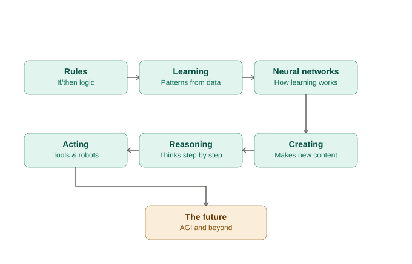

# AI for Kids: Rules → Learning → Neural Networks → Creating → Reasoning → Acting → The Future

A hands-on AI course for children (ages ~10–14, no coding experience required), built around a 7-stop
learning journey that mirrors the real history of AI. Every module has a short teacher script, a
kid-friendly analogy, an unplugged (no-computer) activity, and a runnable Python tutorial.

## The Journey



```
 1. RULES              "A computer that only does exactly what it's told"
        |
 2. LEARNING            "A computer that finds patterns in examples"
        |
 3. NEURAL NETWORKS     "How learning actually happens, inside the 'brain'"
        |
 4. CREATING            "AI that generates new text, not just predictions"
        |
 5. REASONING           "AI that plans and thinks in steps before answering"
        |
 6. ACTING              "AI that uses tools and controls the physical world"
        |
 7. THE FUTURE          "AGI, ethics, and what comes next"
```

Each stop deliberately builds on the one before it:
- **Rules** gives kids a concrete baseline (if/else logic) to contrast everything else against.
- **Learning** breaks that baseline — patterns learned from data, not hand-written rules.
- **Neural Networks** opens the black box: *how* does a machine "learn" a pattern?
- **Creating** shows learning applied to generation — predicting the next word, not just a label.
- **Reasoning** shows AI thinking in steps before responding (the planning half of an agent).
- **Acting** shows AI using tools and controlling machines (the doing half of an agent — includes robots).
- **The Future** zooms out to AGI, safety, and ethics — a running thread from Module 1 onward.

## Repo Structure

```
ai-course-for-kids/
├── README.md                  <- you are here
├── requirements.txt           <- Python dependencies (all free/open-source)
├── LICENSE
├── 01_rules/
├── 02_learning/
├── 03_neural_networks/
├── 04_creating/
├── 05_reasoning/
├── 06_acting/
├── 07_the_future/
└── capstone/                  <- final project template, ties all 7 modules together
```

Each module folder has the same layout:
```
0X_module_name/
├── README.md          <- teacher script, analogy, vocab, unplugged activity, discussion Qs
└── tutorial.py         <- the hands-on coding tutorial for that module (heavily commented)
```

## How to Run the Code

No installation required if you use **Google Colab** (recommended for classrooms):
1. Go to https://colab.research.google.com
2. File → Upload notebook, or just copy-paste the contents of any `tutorial.py` into a new cell.
3. Run with Shift+Enter.

To run locally instead:
```bash
git clone <this-repo-url>
cd ai-course-for-kids
pip install -r requirements.txt
python 02_learning/tutorial.py
```

## Suggested Pacing (7-week version, 1 stop/week)

| Week | Module | Unplugged Activity | Coding Tutorial |
|---|---|---|---|
| 1 | Rules | 20 Questions with fixed rules | Rule-based chatbot |
| 2 | Learning | Fruit sorting (Teachable Machine) | Ice cream sales predictor |
| 3 | Neural Networks | "Human neural network" signal-passing game | Build a tiny neural net from scratch |
| 4 | Creating | Next-word guessing game | Tiny text generator |
| 5 | Reasoning | "Think aloud" step-by-step puzzle solving | Chain-of-thought vs. straight-to-answer |
| 6 | Acting | Sense-think-act blindfold maze + tool-use demo | Agent with a calculator tool + virtual self-driving car |
| 7 | The Future + Capstone | Narrow vs. general sorting, AGI debate | Capstone presentations |

Can be compressed into a single-day or two-day camp by trimming discussion time.

## A Thread to Repeat Every Module: Data & Bias

At the end of every module, ask: **"What data would this need, and who could it get wrong?"**
This one habit, repeated seven times, builds real AI literacy far better than a single ethics
lecture at the end. It's referenced in every module's README under "Data & Bias Checkpoint."

## License

MIT — see `LICENSE`. Free to use, adapt, and remix for classrooms.
