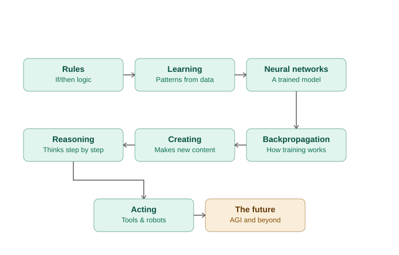

# AI for Teens: Rules → Learning → Neural Networks → Backpropagation → Creating → Reasoning → Acting → The Future

A hands-on AI course for students aged 14 and up, no prior coding experience required, built around
an 8-stop learning journey that mirrors the real history and mechanics of AI. Every module has a
teacher script, an analogy, an unplugged (no-computer) activity, and a runnable Python tutorial —
and every "AI" example is either a **real, established model** (scikit-learn's `LinearRegression`,
`MLPClassifier`, `DecisionTreeClassifier`) or, where we build something by hand, is explicitly labeled
as hand-coded logic so students can see the difference for themselves.

## The Journey



```
 1. RULES              "A computer that only does exactly what it's told"
        |
 2. LEARNING            "A computer that finds patterns in examples"
        |
 3. NEURAL NETWORKS     "A real, established model: scikit-learn's MLPClassifier"
        |
 4. BACKPROPAGATION     "How that model actually trains itself, step by step"
        |
 5. CREATING            "AI that generates new text, not just predictions"
        |
 6. REASONING           "AI that plans and thinks in steps before answering"
        |
 7. ACTING              "AI that uses tools and controls the physical world"
        |
 8. THE FUTURE          "AGI, ethics, and what comes next"
```

Each stop deliberately builds on the one before it:
- **Rules** gives students a concrete baseline (if/else logic) to contrast everything else against.
- **Learning** breaks that baseline — patterns learned from data, not hand-written rules.
- **Neural Networks** introduces a real, established model (not a toy) that can learn complex patterns.
- **Backpropagation** opens the hood on that exact model and rebuilds its training loop by hand, so
  the calculus-driven mechanism is no longer a black box.
- **Creating** shows learning applied to generation — predicting the next word, not just a label.
- **Reasoning** shows AI thinking in steps before responding (the planning half of an agent).
- **Acting** shows AI using tools and controlling machines (the doing half of an agent — includes robots).
- **The Future** zooms out to AGI, safety, and ethics — a running thread from Module 1 onward.

## Repo Structure

```
ai-course-for-kids/
├── README.md                  <- you are here
├── requirements.txt           <- Python dependencies (all free/open-source)
├── LICENSE
├── ai_learning_journey_map.svg
├── 01_rules/
├── 02_learning/
├── 03_neural_networks/
├── 04_backpropagation/
├── 05_creating/
├── 06_reasoning/
├── 07_acting/
├── 08_the_future/
└── capstone/                  <- final project template, ties all 8 modules together
```

Each module folder has the same layout:
```
0X_module_name/
├── README.md          <- teacher script, analogy, vocab, unplugged activity, discussion Qs
└── tutorial.py         <- the hands-on coding tutorial for that module (heavily commented)
```

## How to Run the Code

No installation required if you use **Google Colab** (recommended for classrooms):
1. Go to https://colab.research.google.com
2. File → Upload notebook, or just copy-paste the contents of any `tutorial.py` into a new cell.
3. Run with Shift+Enter.

To run locally instead:
```bash
git clone <this-repo-url>
cd ai-course-for-kids
pip install -r requirements.txt
python 02_learning/tutorial.py
```

## Suggested Pacing (8-week version, 1 stop/week)

| Week | Module | Unplugged Activity | Coding Tutorial |
|---|---|---|---|
| 1 | Rules | 20 Questions with fixed rules | Rule-based chatbot |
| 2 | Learning | Fruit sorting (Teachable Machine) | Ice cream sales predictor (`LinearRegression`) |
| 3 | Neural Networks | "Human neural network" signal-passing game | Train scikit-learn's real `MLPClassifier` |
| 4 | Backpropagation | "The Blame Chain" game | Manual gradient descent, single neuron + full network |
| 5 | Creating | Next-word guessing game | Frequency-weighted text generator |
| 6 | Reasoning | "Think aloud" step-by-step puzzle solving | Hand-coded rules vs. a trained classifier |
| 7 | Acting | Sense-think-act blindfold maze + tool-use demo | Tool-using agent + hand-coded vs. trained self-driving decisions |
| 8 | The Future + Capstone | Narrow vs. general sorting, AGI debate | Capstone presentations |

Can be compressed into a single-day or two-day camp by trimming discussion time.

## A Thread to Repeat Every Module: Data & Bias

At the end of every module, ask: **"What data would this need, and who could it get wrong?"**
This one habit, repeated eight times, builds real AI literacy far better than a single ethics
lecture at the end. It's referenced in every module's README under "Data & Bias Checkpoint."

## Real AI vs. Hand-Coded Logic — What's Actually Happening in Each Tutorial

A fair question students should ask about every "AI" example: **did a human write the logic, or did
the computer learn it from data?** Here's an honest breakdown:

| Module | What's really happening |
|---|---|
| 1. Rules | 100% hand-coded — deliberately, to give a baseline to contrast against |
| 2. Learning | Real, established ML — `LinearRegression().fit()` discovers a slope/intercept from 9 data points; the tutorial prints the learned formula so you can see nobody typed it |
| 3. Neural Networks | Real, established ML — scikit-learn's `MLPClassifier`, the same kind of model used in production. `.fit()` is treated as a (temporary) black box on purpose |
| 4. Backpropagation | Real ML, built from scratch — the exact training algorithm behind Module 3's black box, implemented by hand with `numpy` so every gradient is visible |
| 5. Creating | Real (tiny) statistical model — next-word probabilities are counted directly from training text, and generation samples from those learned probabilities, not a uniform guess |
| 6. Reasoning | Contains **both**, side by side on purpose: hand-coded word lists vs. a model trained on 10, then 24, labelled examples — showing real ML failing with too little data and improving with more |
| 7. Acting | Contains **both**, side by side on purpose: hand-typed thresholds vs. a decision tree trained on 13 labelled examples that discovers its own thresholds |
| 8. The Future | Not a model — a sorting exercise/discussion tool |

Modules 6 and 7 are intentionally built as direct comparisons: run the hand-coded version, then the
trained version, right next to each other, so the difference is visible in actual running code, not
just described in prose. Module 4 is the payoff for the whole "black box" tension the course builds
up to that point — it's where "the computer learned it" stops being a phrase you take on faith.

## License

MIT — see `LICENSE`. Free to use, adapt, and remix for classrooms.
